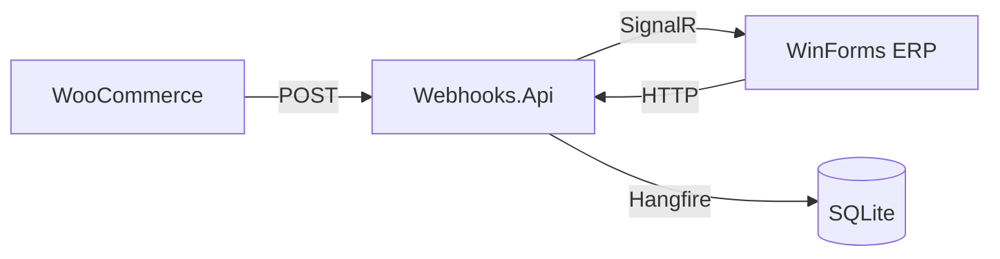

# Plan: SignalR + Ejemplo WinForms

## Objetivo
Agregar notificaciones en tiempo real al módulo de webhooks y crear una aplicación WinForms de ejemplo que muestre cómo integrar con un ERP.

---

## Arquitectura

**Flujo:**
1. WooCommerce envía webhook → API lo recibe
2. API procesa y notifica vía SignalR → WinForms recibe en tiempo real
3. WinForms puede pausar/iniciar la escucha y controlar el servicio API

---

## Cambios Propuestos

### 1. Webhooks.Api - Agregar SignalR Hub

#### [MODIFY] [Program.cs](file:///d:/DESARROLLO/ANTIGRAVITY/WebHooks/src/Webhooks.Api/Program.cs)
- Agregar `services.AddSignalR()`
- Mapear hub `/hubs/webhooks`

#### [NEW] [WebhookHub.cs](file:///d:/DESARROLLO/ANTIGRAVITY/WebHooks/src/Webhooks.Api/Hubs/WebhookHub.cs)
- Hub SignalR para broadcast de eventos
- Métodos: `OnConnected`, `OnDisconnected`, `Subscribe`, `Unsubscribe`

---

### 2. Webhooks.Core - Notificar vía SignalR

#### [MODIFY] [WebhookProcessor.cs](file:///d:/DESARROLLO/ANTIGRAVITY/WebHooks/src/Webhooks.Core/Services/WebhookProcessor.cs)
- Inyectar `IHubContext<WebhookHub>`
- Después de procesar → `SendAsync("WebhookReceived", event)`

---

### 3. Nuevo: SampleErpWinForms

#### [NEW] samples/SampleErpWinForms/
Proyecto WinForms .NET 8 con:

| Componente | Función |
|------------|---------|
| `MainForm` | Formulario principal con UI |
| `WebhookClient` | Conexión SignalR al servidor |
| Botones | Iniciar/Pausar/Detener conexión |
| DataGridView | Lista de webhooks recibidos |
| NotifyIcon | Icono en bandeja del sistema |

**Funcionalidades:**
- ✅ Conectar/Desconectar de SignalR
- ✅ Ver webhooks en tiempo real
- ✅ Pausar recepción sin desconectar
- ✅ Log de actividad
- ✅ Filtrar por tipo de evento

---

## Verificación

1. Ejecutar `Webhooks.Api`
2. Ejecutar `SampleErpWinForms`
3. Ejecutar `WooCommerceSimulator` y enviar evento
4. Verificar que aparece instantáneamente en WinForms
